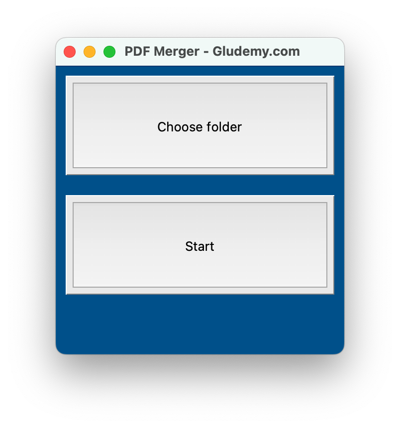
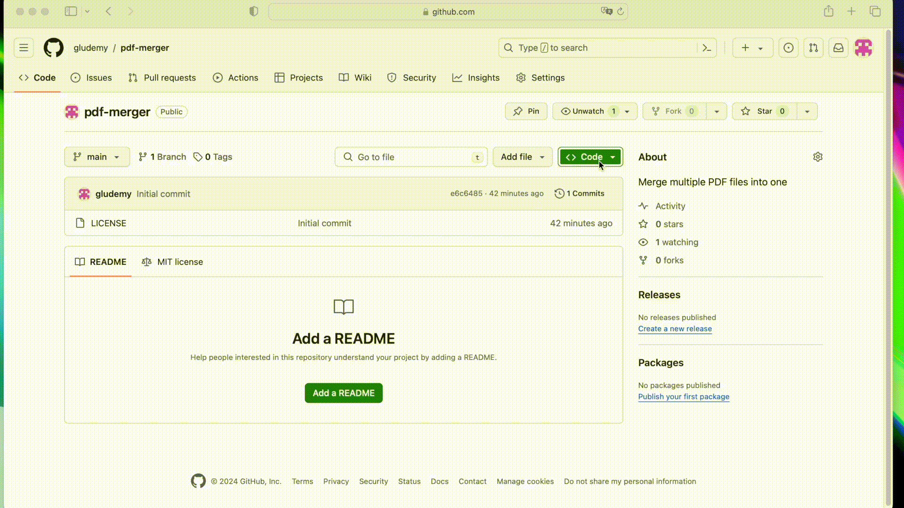

# PDF Merger



This simple desktop App allow you to merge multiple PDF files into one single file, if a page in any of a PDF file is in landscape view, it will be rotated to be protrait before it been merged.

This simple desktop application allows you to merge multiple PDF files into a single document. If any page within a PDF is in landscape orientation, it will be automatically rotated to portrait orientation before being merged.


## How to use?

### Method 1: run the Python script to launch App

1. Download and extract this repository to your computer.

2. Install the `PyPDF2` version 2.5.0 to your Python environment.
3. Run the Python script `One.py`.

If you don't know how to run a Python script, check [this 2-minute tutorial](https://gludemy.com/how-to-run-a-python-script-098fe2797f2e) for beginner.


### Method 2: build the App into exe file (for Windows user)

1. Download and extract this repository into your computer.
2. Open terminal from the folder of this repository.
3. Run the following command to build exe.
  
```
pyinstaller.exe --onefile --icon=one.ico One.py
```

4. Go to the `dist` folder and click on the exe file to launch the App.


